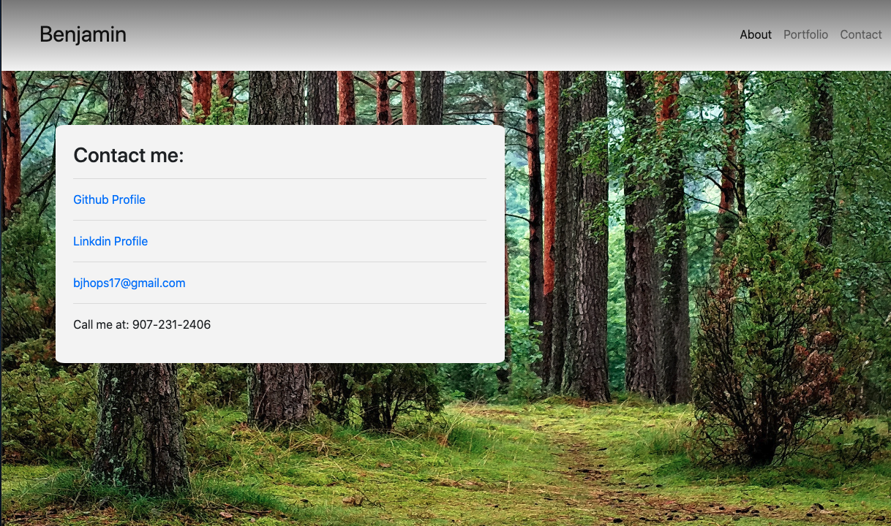

# updated-portfolio

An updated portfolio using same code as last portfolio with updated pages. The bio is a little snipet about the start of my career path with a link to a downloadable resume. The background uses same design with alittle different shade of grey/green. The contact page has been updated with a nice background image and links to my various professional social media accounts. The porfolio page now has screen shots of some of my projects that act as links to launch the app. There is also a link to each projects repository.